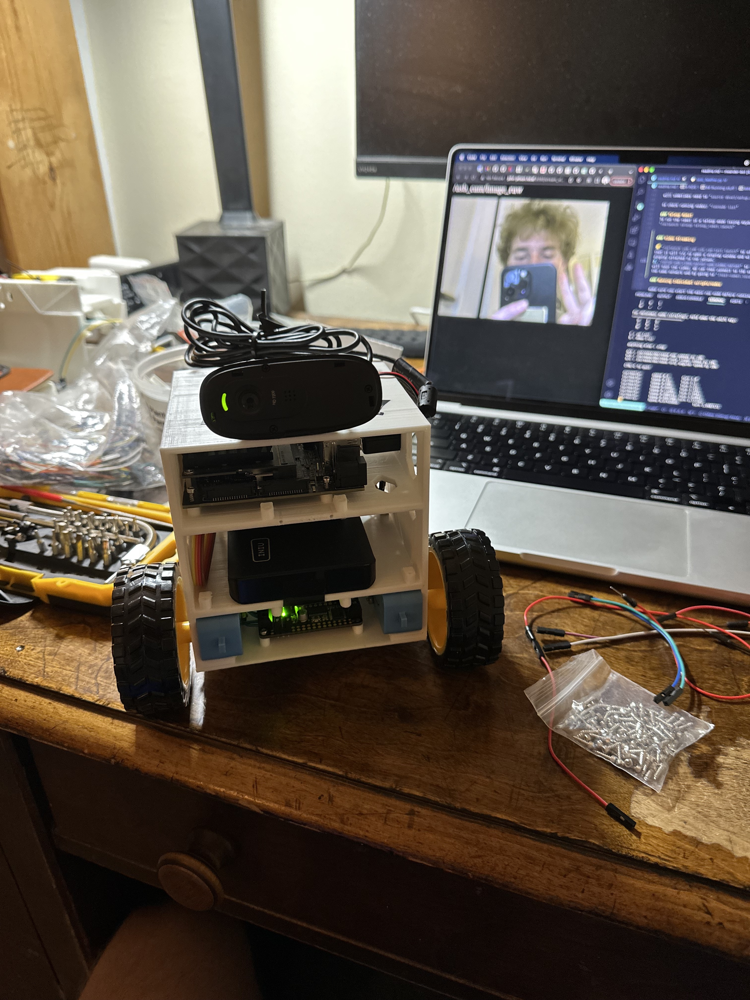

# Meander Bot

The goal of this project is to create a modified jetbot that can patrol or meander around my house.

Robot Hardware:
- jetson nano
- adafruit featherwing motorcontroller
- [DG10D-E-PH](https://www.sparkfun.com/products/16413) motor with [encoder](https://ros-mobile-robots.com/DG01D-E-motor-with-encoder/)
- Slamtex RPLidar A1 lidar
- Luxonis OAK-D stereo AI camera
- MPU6050 imu


<p align="center">
    
</p>
<p align="center" style="font-size: 14px;"><i>CAD of Meandor Bot</i></p>

<p align="center">
    
</p>
<p align="center" style="font-size: 14px;"><i>Early version of Bot</i></p>

<p align="center">
    
</p>
<p align="center" style="font-size: 14px;"><i>First assembled version of bot with video server</i></p>


# Setup

## Jetson Setup
note: that I don't remeber but you need to configure the I2C pins (maybe some other pin thing) on the jetson, there is some config thing
[here](https://learn.adafruit.com/circuitpython-libraries-on-linux-and-the-nvidia-jetson-nano/initial-setup) may be helpful

we will also need to set the correct permissions so our user can access GPIO. Follow instruction from [Jetson GPIO](https://github.com/NVIDIA/jetson-gpio/tree/6cab53dc80f8f5ecd6257d90dc7c0c51cb5348a7) to set the correct user permissions. I ran into issues where I would have to reset the rules/permissions every time the Jetson rebooted and found a fix [here](https://github.com/NVIDIA/jetson-gpio/issues/20).

## I2C
to check if a device is connected via I2C use:<br>
`i2cdetect -y -r 1` to see I2C bus 1 (pin 3 SDA and 5 SCL)<br>
`i2cdetect -y -r 0` to see I2C bus 0 (pin 27 SDA and 28 SCL)<br>

oddly enough the i2c bussses are mislabled when using busio:
- to used bus0: `i2c = busio.I2C(board.SCL_1, board.SDA_1)`
- to used bus1: `i2c = busio.I2C(board.SCL, board.SDA)`

## Setting Jetson power setting
`sudo nvpmodel -q` to see current power setting<br>
`sudo nvpmodel -m0` for maxn power setting (10W)<br>
`sudo nvpmodel -m1` for 5W power setting (recommended when not using barrel connector)<br>

## installing ROS melodic on Jetson
[here](https://www.stereolabs.com/blog/ros-and-nvidia-jetson-nano/)

# Info

## Motor drivers info

// feather motor driving wiring
- 5v-12v input power
- 3.3v logic power (across from input power)
- communication
- output on long ends of controller

<p align="center">
    
</p>
<p align="center" style="font-size: 14px;"><i>Wiring photo of the Feather motor driver</i></p>

The brown and white cable in the lower left of the driver are the I2C connectors with the brown wire connecting to `3` and the white to `5`. The red and black cable near the top of the feather are the logic 3.3V power. This is connected to the Jetson's 3.3V and ground. The red and black cable near the bottom of the feather is the VIN or power to the motors. In this case it is plugged into the Jetson's 5V and ground but this is not super safe for the Jetson to power motors off of its pins so instead I now plug it into an external battery (still experimenting with the voltage but it can handle up to 13V).

## IMU info
[blog](https://automaticaddison.com/visualize-imu-data-using-the-mpu6050-ros-and-jetson-nano/) that has some basic info on getting the sensor working.

I've decided to use the MPU6050 ROS package from [Brazilian-Institute-of-Robotics](https://github.com/Brazilian-Institute-of-Robotics/mpu6050_driver) (BIR) you can find the instructions on setting up their project and nodes there.

### Wiring / Sensor setup
I am currently using the MPU6050 IMU. If you are looking to get an IMU I would recommend getting a more new sensor like the BNO085 has show better accuracy and has a large community base. I am using the 6050 since it is what I had around.

We will wire the 6050 directly to the Jetson nano. We connect the IMUs VCC to 3.3V and the ground to ground on the Jetson. I also connected the SDA/SCL to the Jetson's second I2C pins on pin 27 (SDA) and 28 (SCL). The 6050 also uses address `68` on i2c.

In the BIR ROS package we need to switch the `mpu_settings.yaml` to reflect that we are using the right I2C on the Jetson so switch to `bus_uri: "/dev/i2c-0"` if using pin 27/28 or leave it at `bus_uri: "/dev/i2c-1"` if using 3/5.

## Lidar info
The Lidar uses a separate ROS package that can be found here:
[driver code repo](https://github.com/Slamtec/rplidar_ros) (note that it is not contained in this repo).

Download/clone the ROS package into the `src` folder of you ROS workspace.

Before using may need to run `sudo chmod 777 /dev/ttyUSB0` to allow for the lidar to communicate with the jetson.

Run rplidar node and view in the rviz:<br>
```
roslaunch rplidar_ros rplidar.launch (for RPLIDAR A1/A2)
```
If we don't want to use rviz then we can
run rplidar node and view using test application:<br>
```
roslaunch rplidar_ros view_rplidar.launch (for RPLIDAR A1/A2)
```
then run to see the lidar output in the terminal:
```
rosrun rplidar_ros rplidarNodeClient
```

# ROS

`catkin build` to build/compile code. You made need to install `sudo apt install python3-catkin-tools` to use it.

Some info about ROS can be found in [MRover's wiki](https://github.com/umrover/mrover-ros/wiki/4.-Fundamentals-of-ROS)

## Running ROS code

Before running code we need to `source devel/setup.bash`

to check running nodes: `rosnode list`

### Teleop Robot
To run the robot in a teleop mode (using keyboard control):
```
roslaunch meanderbot teleop.launch
```


### Video Streaming
We are currently using MJPEG ROS package to stream camera footage from the bot. You can install the package here [web_video_server](http://wiki.ros.org/web_video_server).

1. `roslaunch usb_cam usb_cam-test.launch` to start the camera node. Note that it will try to open a display window and will fail because there is no display attached to the jetson (but the camera node will still work).
2. `rosrun web_video_server web_video_server` to start the web server that will host the video. We can then connect to the server as long as we are on the same network and by going to `(host-name).local:8080` so in my case `john-jetson.local:8080`

### Running Individual scripts/nodes

make sure you start the main ros node before running other nodes:<br>
`roscore`

running motorcontroller node:<br>
`rosrun meanderbot motor_controller.py`

# TODO
- ~~begin CAD work on chassis~~
- IMU node 
    - mostly working as of now but need to make sure TF tree is setup correctly
- lidar node
    - check if it works in rviz (drivers seems work so far)
- encoder hardware / code
- power concerns (how tf we gonna power everything)

## Alternative Hardware
- [Larger Motors with encoder](https://www.pololu.com/product/4806)
